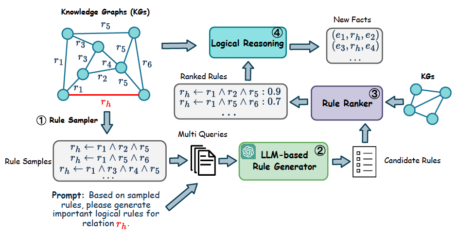
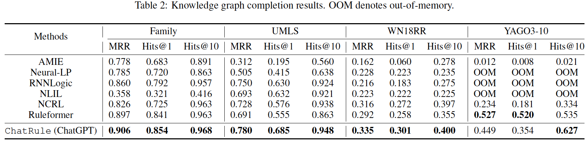
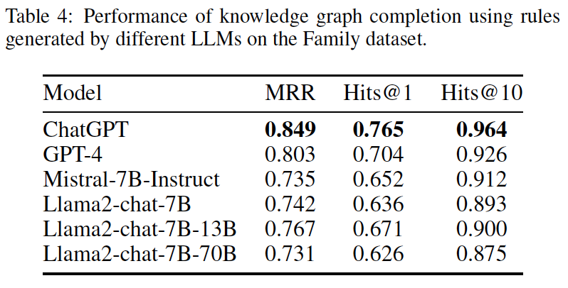
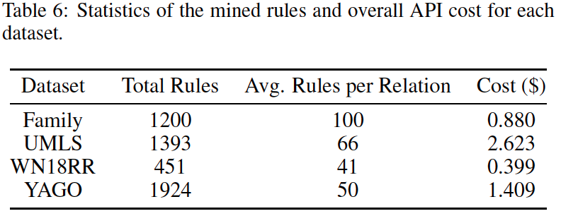
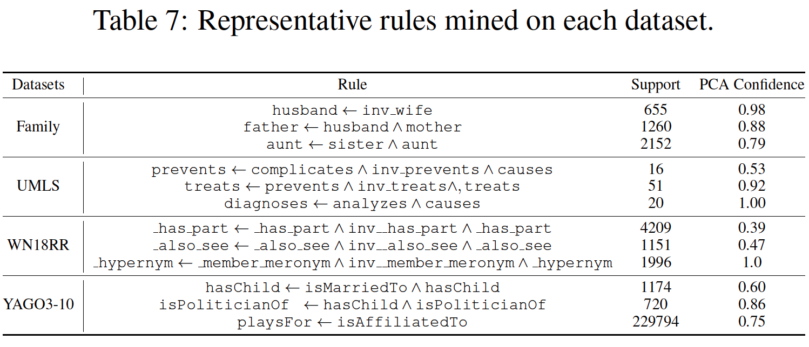

# ChatRule

 Mining Logical Rules with Large Language Models for Knowledge Graph Reasoning with 1 dollar.

Official Implementation of "[ChatRule: Mining Logical Rules with Large Language Models for Knowledge Graph Reasoning](https://arxiv.org/abs/2309.01538)".




Logical rules are essential for uncovering the logical connections between relations, which could improve reasoning performance and provide interpretable results on knowledge graphs (KGs). In this paper, we propose a novel framework, ChatRule, unleashing the power of large language models (LLMs) for mining logical rules over knowledge graphs with less than **1 dollar**. The final rules can be used to conduct reasoning over KGs without additional model training.

## Requirements
```
pip install -r requirements.txt
```

Set your OpenAI API key in `.env` file

## Mining Rules with ChatRule

Please check examples of different datasets and LLMs in [here](scripts/run_chatrule.sh).

1.  Sample Paths
```
python path_sampler.py --dataset ${DATASET} --max_path_len 3 --anchor 100 --cores 8
```
2. Generate Rules
```
python chat_rule_generator.py --dataset ${DATASET} --model_name gpt-3.5-turbo -f 50 -l 10
```
3. Collect and Clean Rules
```
python clean_rule.py --dataset ${DATASET} -p gpt-3.5-turbo --model none
```
4. Rank Rules
```
python rank_rule.py --dataset ${DATASET} -p clean_rules/${DATASET}/gpt-3.5-turbo-top-0-f-50-l-10/none
```
5. Evaluate Completion
```
python kg_completion.py --dataset ${DATASET} -p ranked_rules/${DATASET}/gpt-3.5-turbo-top-0-f-50-l-10/none/all
```

## Reproduce KGC results with mined rules.

```
python kg_completion.py --dataset family -p FinalRules/$family
python kg_completion.py --dataset umls -p FinalRules/umls
python kg_completion.py --dataset wn-18rr -p FinalRules/wn-18rr
python kg_completion.py --dataset yago -p FinalRules/yago
```

## Results





## Bibinfo
If you found this repo helpful, please help us by citing this paper:
```
@article{luo2023chatrule,
  title={Chatrule: Mining logical rules with large language models for knowledge graph reasoning},
  author={Luo, Linhao and Ju, Jiaxin and Xiong, Bo and Li, Yuan-Fang and Haffari, Gholamreza and Pan, Shirui},
  journal={arXiv preprint arXiv:2309.01538},
  year={2023}
}
```